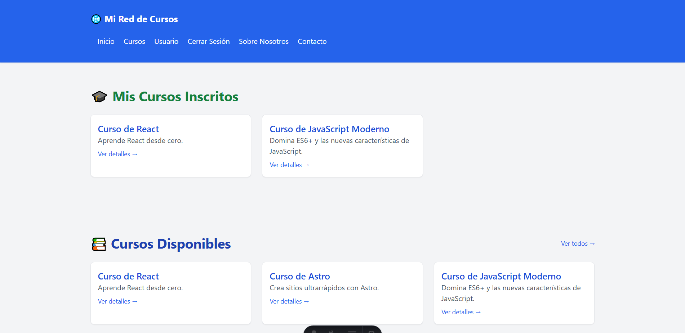
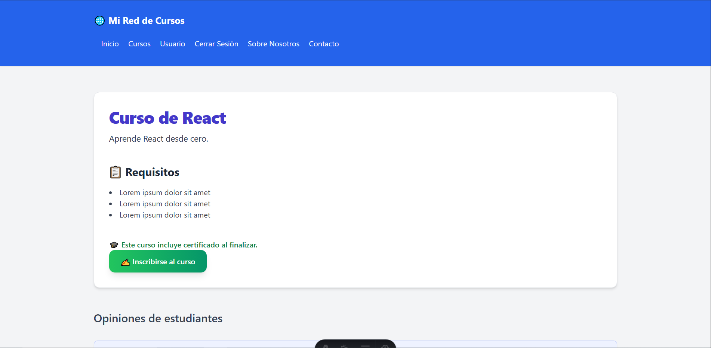
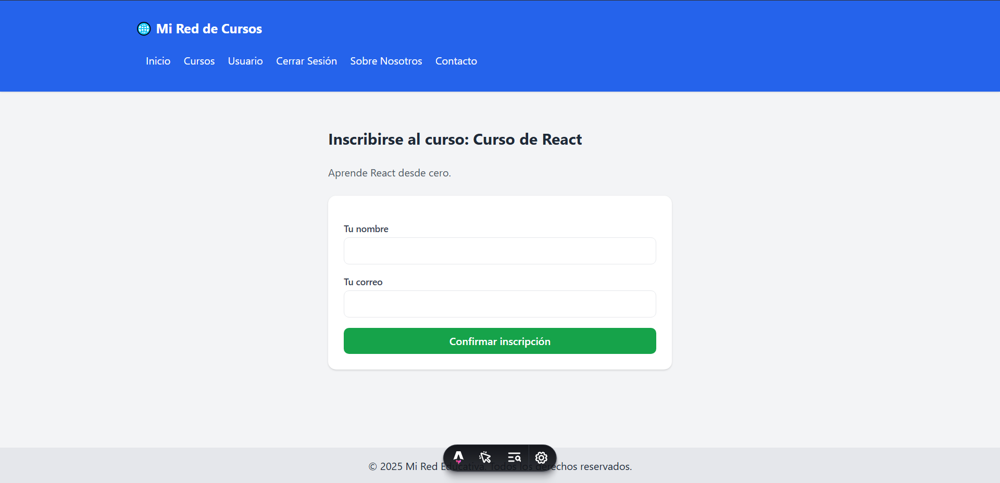
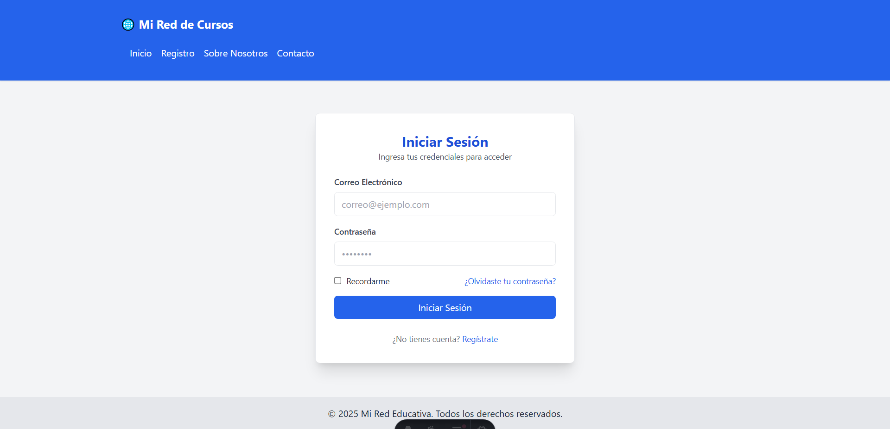
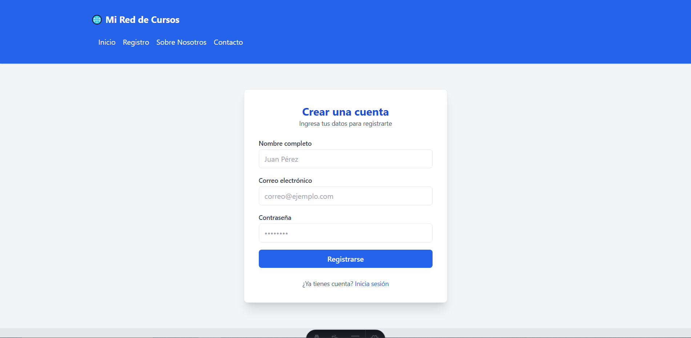
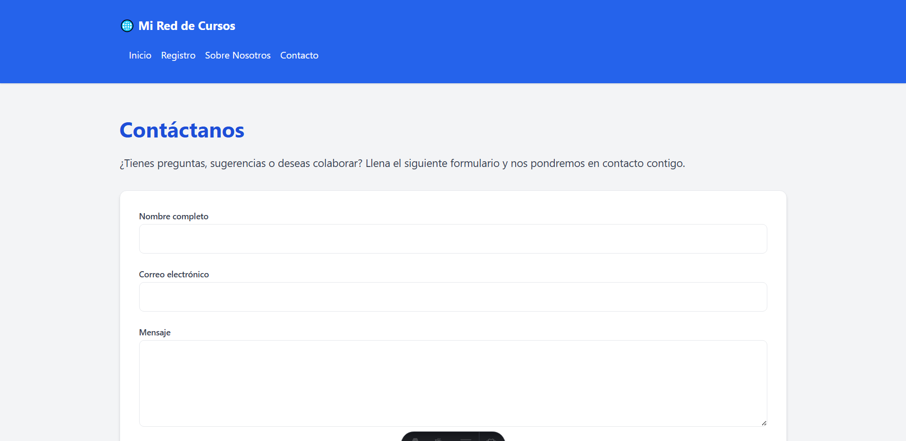
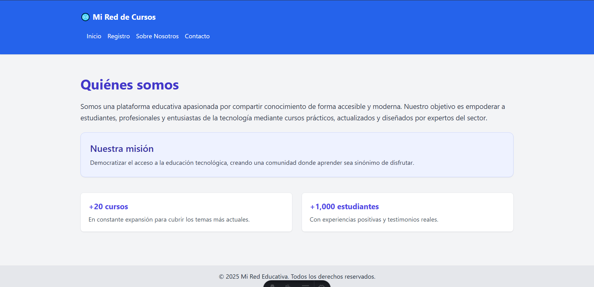

# 🎓 EduFlow – Plataforma Conceptual de Asesorías Estudiantiles

**EduFlow** es un prototipo conceptual de una plataforma web diseñada para facilitar la **gestión de cursos, inscripciones y asesorías educativas**. Este proyecto está construido con **Astro**, **Tailwind CSS** y un enfoque modular, permitiendo escalabilidad y personalización sencilla para futuros desarrollos reales.

---

## 🌟 ¿Qué es EduFlow?

EduFlow (antes llamado “CEPA”) nace como una **prueba de concepto** que simula cómo podría funcionar una red académica de asesorías estudiantiles. El objetivo es centralizar:

- 📚 La oferta de cursos/asesorías.
- 🧑‍🎓 La inscripción de estudiantes.
- 💬 Opiniones y retroalimentaciones de los cursos.

Todo esto bajo una arquitectura moderna con enfoque educativo.

---

## 🧩 Estructura del proyecto
```
📁 src
├── data # Datos simulados (cursos.js)
├── components # Componentes reutilizables como CursoCard
├── cursos # Rutas dinámicas de cursos
├── inscribirse # Formulario de inscripción a cursos
├── layouts # Plantillas reutilizables para vistas
├── styles # Archivos CSS globales
└── pages # Páginas como Dashboard, About, Contacto, etc.
```


---

## 🚀 Tecnologías utilizadas

- [Astro](https://astro.build/) – Framework moderno para sitios rápidos
- [Tailwind CSS](https://tailwindcss.com/) – Estilizado rápido y responsivo
- HTML + JavaScript Vanilla
- Sistema modular por componentes

---

## 🧠 Objetivo del prototipo

Este proyecto no tiene conexión a base de datos ni backend real; su propósito es **visualizar y simular** cómo podría funcionar una plataforma de asesorías estudiantiles en un contexto educativo universitario.

Puedes navegar entre cursos, ver opiniones simuladas y "simular" una inscripción con rutas dinámicas.

---

## 🖼️ Capturas del Proyecto

### 🏠 Página de Inicio


---

### 📋 Detalles del Curso


---

### 📝 Formulario de Inscripción


---

### 🔐 Iniciar Sesión


---

### 🧾 Registro de Usuario


---

### 📞 Página de Contacto


---

### ℹ️ Acerca de (About)



---

## ✅ Estado del proyecto

> 🧪 Proyecto en etapa conceptual y de prototipo. No incluye backend ni almacenamiento persistente.

---

## 📬 Contacto

Para sugerencias, ideas o colaboración, puedes abrir un issue o dejar un comentario.

---

Licencia

MIT